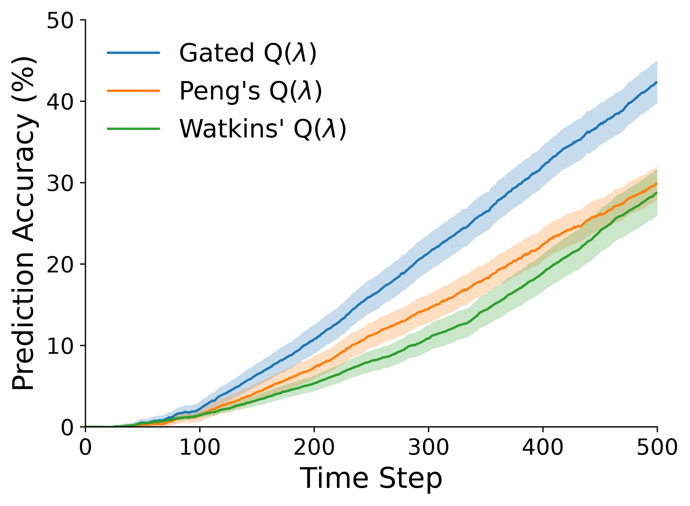
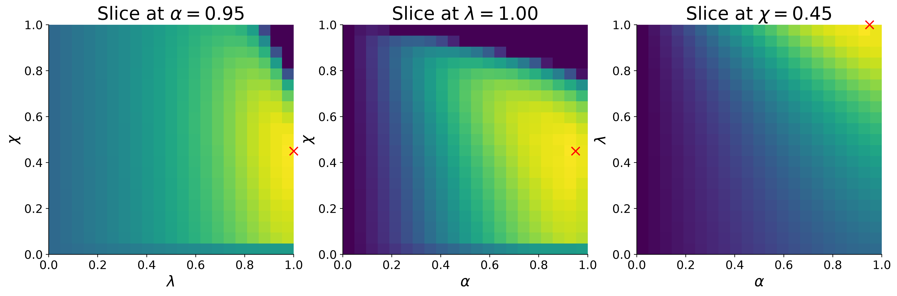

# Gated Q-learning: Add Off-Policy Bias to Taste

Official code for the paper *"Gated Q-learning: Add Off-Policy Bias to Taste"*, presented at the Reinforcement Learning Conference (RLC 2026) and published in the Reinforcement Learning Journal (RLJ).
Provides a reference implementation of **Gated Q(λ)** using eligibility traces, and reproduces Figures 1 and 2 from the paper.

<!-- **Links:**
- Paper (arXiv)
- Poster
- Recorded Talk
- Slides -->

Code is released under the [MIT License](./LICENSE).
Please cite the journal paper when using the code in any derivative works:

```bibtex
@article{daley2026add,
  title={Gated {Q}-learning: Add Off-Policy Bias to Taste},
  author={Daley, Brett},
  journal={Reinforcement Learning Journal (RLJ)},
  year={2026}
}
```

## Overview

> **tl;dr:** *Gated Q-learning implements an exploration-aware decay mechanism to softly adjust off-policy bias without importance sampling.*

Q(λ) is Q-learning with eligibility traces.
**Gated** Q(λ), introduced in the paper, adds a hyperparameter (the *gate*, χ ∈ [0, 1]) to the update.
Traces decay by γλ as usual, but are penalized by an additional factor of χ whenever the behavior policy takes a non-greedy action.
The gate therefore controls how much off-policy bias the trace is allowed to accumulate:

- Less bias (χ = 0) → slower contraction but lower asymptotic error (**Watkins' Q(λ)**).
- More bias (χ = 1) → faster contraction but higher asymptotic error (**Peng's Q(λ)**).

Rather than committing to one of the two extremes, Gated Q(λ) exposes bias as a tunable quantity, letting you dial it in *to taste*.
Carefully balancing these opposing forces yields faster learning, as demonstrated by the experiments below.

> The paper's theory goes beyond just Gated Q(λ); it establishes guarantees for all Q-learning methods that vary the trace as a function of the state-action pair, *λ(s,a)*. Almost none of these variants have been explored. Test your own Q(λ) idea by adapting the experiment code here!

## Results

The figures below are those published in the paper.
See [Reproducing the Experiments](#reproducing-the-experiments) for instructions.

**Figure 1.** Learning curves for the 19-state random walk, swept over the full (α, λ, χ) grid.
Compares Gated Q(λ) at its best gate (χ = 0.45) against the Watkins' (χ = 0) and Peng's (χ = 1) endpoints, each at its own best (α, λ).



**Figure 2.** The corresponding sensitivity landscape: three 2-D slices through the best grid point, one per axis, with the optimum marked in red.



## Repository Structure

```text
.
├── run_random_walk.py       # Implements Gated Q(λ) and runs the hyperparameter sweep
├── plot_random_walk.py      # Generates learning curves and heatmap from the sweep data
├── utils/                   # Supporting library for run_random_walk.py
├── data/                    # Generated data lands here (contents not tracked)
├── figures/                 # Generated figures land here (contents not tracked)
└── figures_paper/           # Published figures (reference-only)
    ├── learning_curves.png  # Figure 1
    └── 3D_heatmap.png       # Figure 2
```

## Installation

Clone the repository:

```bash
git clone https://github.com/brett-daley/gated-q-learning.git
cd gated-q-learning
```

Create a virtual environment:

```bash
python3 -m venv env
source env/bin/activate
```

Install the dependencies:

```bash
pip install --upgrade pip
pip install -r requirements.txt
```

## Reproducing the Experiments

Run the sweep and write `data/learning_curves.npy`:

```bash
python run_random_walk.py
```

Read the data and store plots in `figures/`:

```bash
python plot_random_walk.py
```

### Computational Requirements

**Caution:** `run_random_walk.py` sweeps a dense 3-D grid and is **not** a laptop-scale job.
The full array is allocated before any work is dispatched, so a machine with less than ~16 GB of free RAM will fail immediately.

| | |
| :--- | :--- |
| Grid | 21 × 21 × 21 = 9,261 points (α, λ, χ each over `linspace(0, 1, 21)`) |
| Runs per point | 300 seeds × 500 steps |
| Tasks dispatched | 2,778,300 |
| Peak memory | ~11.14 GB, allocated up front by a single `np.empty` |
| Output | `data/learning_curves.npy`, ~11.14 GB |
| Wall-clock | ~1 hour on 48 vCPUs (AMD Ryzen Threadripper 3960X, 24C/48T) |

To smoke-test the pipeline cheaply, reduce `N`;
memory and runtime both scale as O(N³).
Update `plot_random_walk.py` to match.

### Data Format

`run_random_walk.py` writes `data/learning_curves.npy`, a float64 array of shape `(21, 21, 21, 300, 501)`:

| Axis | Size | Meaning |
| :--- | :--- | :--- |
| 0 | 21 | Step size α, indexing `linspace(0, 1, 21)` |
| 1 | 21 | Trace decay λ, same grid |
| 2 | 21 | Gate χ, same grid |
| 3 | 300 | Independent run (seeds `0..299`) |
| 4 | 501 | Time step (index 0 is the pre-training measurement) |

Each value is the **normalized error reduction** of the action-value estimates against the analytically computed optimum (*q\**) at that particular time step:

- 0.0 (0%) → No progress relative to initialization.
- 1.0 (100%) → Optimal convergence to *q\**.

Values are unbounded below, with negative values representing *worse* performance than the initialization.

`plot_random_walk.py` averages over the 300 runs and shades a 95% t-interval.
Each mean curve is then summarized by its normalized area under the curve (AUC), and the highest AUC defines the *best* grid point quoted in the figure captions.
